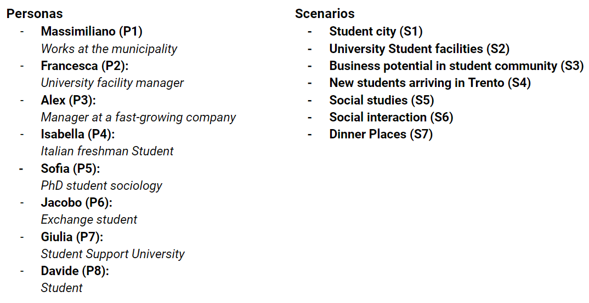

<h1 style="font-size:32px;font-weight:bolder"> Student Lives & Points of interest in Trentino </h1>

<i> By Munkhdelger Bayanjargal and Nina Verbeeke </i>

 

<h1 style="border-bottom: 1px #e1e4e8 solid"> Materials </h1>

<strong> Code </strong>   
The GitHub repository can be found 
[here](https://github.com/n-verbeeke/kge-project-11). Please note that due to privacy reasons, the repository is set to private

<strong> Report </strong>   
The report of this project can be found by clicking here [here](./assets/KGE_Project11_Report.pdf).

<strong> Presentation slides </strong>   
The presentation slides of can be found
[here](./assets/KGE_Project11_Presentation.pdf).

 

<h1 style="border-bottom: 1px #e1e4e8 solid"> Introduction </h1>
The rapid advancement of geospatial and information technology contributes significantly to
human behavior research. Smartphones, equipped with built-in GPS capabilities and various
sensors, enable the collection of massive amounts of high-resolution spatial-temporal data,
tracking the location of individuals over specific time periods. 

> In this research, we will focus on developing a knowledge graph, which will function as a tool for analyzing student behavior and to analyze students' visits to points-of-interest (POI) in Trentino.

In this project, we followed the iTelos methodology, as described in <a href="http://arxiv.org/abs/2105.09418"> this paper</a>. iTelos, a data integration methodology, aims for maximum flexibility in reusing both data and schemas. This goal is achieved by independently developing the data level and the schema level of an application.

 

<h1 style="border-bottom: 1px #e1e4e8 solid"> Project Purpose </h1>
The main objective of this project is to construct a knowledge graph that encapsulates the life
sequences of students. This knowledge graph will serve as a powerful tool for gaining insights
into various aspects of students' daily lives. It will capture visiting points of interest, conducting
events, and more, thereby providing a holistic view of student behavior.

 

<h1 style="border-bottom: 1px #e1e4e8 solid"> Project domain of interest (DoI) </h1>
This project aims to explore students' daily lives by looking at which places they visit in their daily lives. The SmartUnitn2 dataset, which includes GPS locations of students collected via their smartphones, will be used. Our focus is specifically on locations where students stay for a duration, rather than on GPS locations that merely depict movement between places. Spatially, the domain is confined to the region of Trentino, Italy. The SmartUnitn2 dataset will be enriched with data from OpenStreetMap and "Punti di interesse del Trentino" from OpenDataTrentino. The temporal focus is on late 2016, aligning with the GPS data collection period. Annotation of places involves leveraging OpenStreetMap in June 2023 and the "Punti di interesse del Trentino" dataset from April 2014.

 

<h1 style="border-bottom: 1px #e1e4e8 solid"> Personas, Scenarios, and Competency questions </h1>

Building on the project's main purpose outlined, this section aims to further formalize this initial purpose statement by providing scenarios and personas. These user-centered
concepts represent how different users might interact with the knowledge graph. Through
various scenarios and personas, we illustrate how individuals could use the knowledge graph
to achieve specific goals, thus further formalizing the project's purpose. 
Below, we briefly present the various personas and scenarios that were formulated. For a more detailed description, we refer you to Section 3.1 of the report.

<h2> Competency questions </h2>
Based on 8 Personas and 7 Scenarios, we started defining Competency Questions. We were able to come up with 8 competency questions.

 <i> Click here to view the competency questions </i> 

<b>CQ-1 (P1-S1):</b> Massimiliano is currently investigating the categories of places that students most frequently visit, aiming to identify areas where Trento can enhance and improve its offerings to better cater to the student community. Massimiliano needs an overview of the most visited categories of places. What are the top 5 most visited categories of places in Trento?    

<b>CQ-2 (P2-S2):</b> Francesca has noticed that quite a few university facilities need improvement, renovation, and testing for safety. However, there are many facilities that require enhancement. She wants to prioritize the university facilities that are most visited by students. Give the top 5 most visited university facilities.    

<b>CQ-3 (P3-S3):</b> Alex wants to find places where they could potentially start partnerships or collaborations to sell GoodDrinks' hard seltzer drinks. Therefore, he is interested in identifying the most popular out-of-house places where students socialize. Provide Alex with a list of out-of-house places where students mention that they are socializing in their time diaries.   

<b>CQ-4 (P4-S4):</b> Isabella has just arrived in Trento, and she wants to find the supermarket that is most frequently visited by a unique number of students, within a range of 2.5 km from her house. Her house is located at the following latitude and longitude pair: 46.0515, 11.1341. Please provide a recommendation for the most frequently visited supermarkets within 2.5 km of Isabella's house.   

<b>CQ-5 (P5-S5):</b> Sofia is now shifting her focus in her research to the patterns and time spent at outdoor locations, aiming to investigate if there is a relation with the study program of the student. Provide, for each student, the average time spent at specific categories of places and also the study program of the student.    

<b>CQ-6 (P6-S6):</b> It is Friday night at 9 pm, and Jacobo is seeking recommendations for popular places in the city where he can go for a drink and meet fellow students. He wants to find a bar that is well-frequented by the student community in Trento. Please provide the names of the top 3 most popular bars in Trento that are open on Friday at 9 pm.   

<b>CQ-7 (P7-S2):</b> Giulia receives many questions about sports facilities in Trento.   Specifically, students ask her where they can go to engage in sports.   Can you provide a list of all sports facilities visited by students and sort them by the most frequently visited places?   

<b>CQ-8 (P8-S7):</b> This Saturday, Davide is celebrating his birthday, so he plans to go out with his friends for dinner at a restaurant. In search of an affordable yet popular spot, he's exploring dining places frequented by fellow students. Which are the top 5 most-visited restaurants in Trento by students? If possible, please include their contact numbers for Davide to call and reserve a table.

 

<h1 style="border-bottom: 1px #e1e4e8 solid"> ER Model </h1>
From the competenecy questions, relating to Personas and Scenarios, we extract entities with properties. 
In consideration with these identified entities, we designed an Entity-relationship (ER) model as shown in the figure below. 

'StayPoints' are specific instances of individuals spending time in a particular location. A 'POI', which is a place, can be considered as a "timeless" generalization of its time-dependent counterpart, namely 'StayPoint'. The 'Trajectory' describes the path followed by an object in motion, and 'POIs' are specific locations of interest on a map. The list below provides a defintion of these concepts:
- <b> Trajectory</b>: the path followed by an object moving through space
- <b> StayPoint</b>: a single instance of a person spending some time in one place 
- <b>POI</b>: a specific and notable place marked on a map due to its distinctive features where one or more objects have stayed

 

<h1 style="border-bottom: 1px #e1e4e8 solid"> Information Gathering </h1>

<h2> Data Resources </h2>
<b> Informal Data Sources: </b> 

- Punti di interesse del Trentino (OpenDataTrentino)  
[https://dati.trentino.it/dataset/punti-di-interesse-del-trentino](https://dati.trentino.it/dataset/punti-di-interesse-del-trentino)  

- SmartUnitn2  
Not publicly available

 
<b> Formal Data Sources:</b> 

- OSM Places Trentino dataset provided by the DataScientia Foundation
[https://datascientiafoundation.github.io/LiveDataTrentino/datasets/OSM%20Places/](https://datascientiafoundation.github.io/LiveDataTrentino/datasets/OSM%20Places/)

 

<h2> Knowledge Resources </h2>
<b> Formal Knowledge Source: </b> 

- OSM Lightweight Ontology provided by The DataScientia Foundation  
[https://datascientiafoundation.github.io/LiveKnowledge/datasets/osm-lightweight-ontology/](https://datascientiafoundation.github.io/LiveKnowledge/datasets/osm-lightweight-ontology/) 

   

<h1 style="border-bottom: 1px #e1e4e8 solid">  Teleontology </h1>
The Students' POI Visits Teleontology was constructed based on the Trentino Spatial Teleology, the Trentino OSM LWOntology, and the SmartUnitn2 Teleology. The Students' POI Visits Teleontology can be found in the figure below. 

   

 

<h1 style="border-bottom: 1px #e1e4e8 solid"> Final Knowledge Graph </h1>

After following all the steps outlined in more detail in the project report, we managed to build a knowledge graph based on the Students' POI Visits Teleontology and the associated data. A screenshot of a small part of the knowledge graph can be seen in the figure below.

We evaluated our competency questions through the use of SPARQL queries with the GraphDB tool. For example, one of the competency questions was:

<code>
 CQ-7 (P7-S2): Giulia receives many questions about sports facilities in Trento. Specifically,  students ask her where they can go to engage in sports. Can you list all sports facilities students visit and sort them by the most frequently visited places?
</code>

The following SPARQL query was used to retrieve the answer to this competency question:

This query provided us with the following results, showing the most frequently visited sports facilities, which is the answer to the competency question:

 

<h1 style="border-bottom: 1px #e1e4e8 solid">  Conclusion </h1>
In conclusion, this research has successfully achieved its objective of constructing a knowledge graph that encapsulates the life sequences of students. This knowledge graph serves as a valuable tool for gaining insights into various aspects of students’ daily lives, capturing points-of-interest places they visit, and conducting events. The practical outcomes of this project signify a promising starting point, with room for further enhancement and refinement. Looking ahead, several potential directions for future work have been identified. These include integrating more data from the student dataset, such as mood or personality, and incorporating more location-specific data into the knowledge graph, possibly from additional sources. There is also the potential to implement the use of a different dataset with GPS locations in the Trentino region. A shift in focus towards the student life sequence, as opposed to merely points-of-interest visits, could provide further depth to the analysis. Additionally, a more detailed examination of events, including the implementation of a method to analyze events taking place at specific locations, could enrich the understanding of student behavior patterns. Overall, while the project has yielded practical outcomes, it represents just the beginning of a broader exploration into student behavior using KGs. The potential for future work is extensive, promising exciting developments in this field of research.